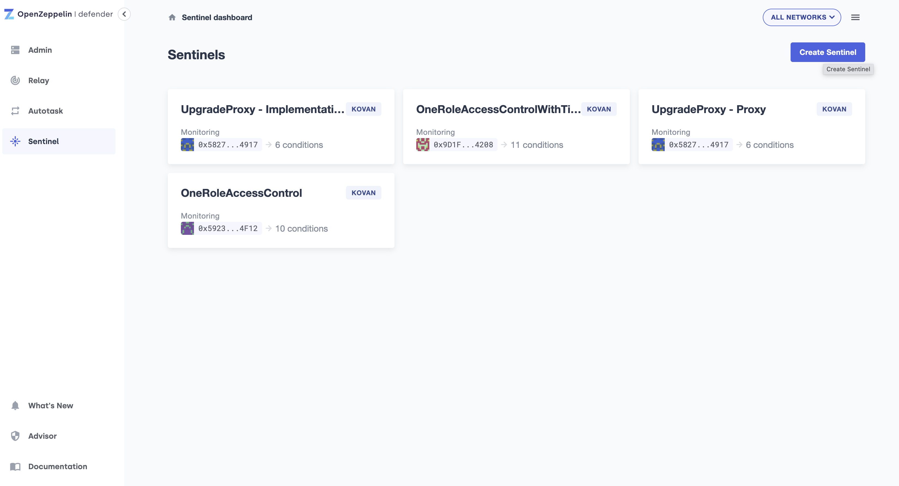
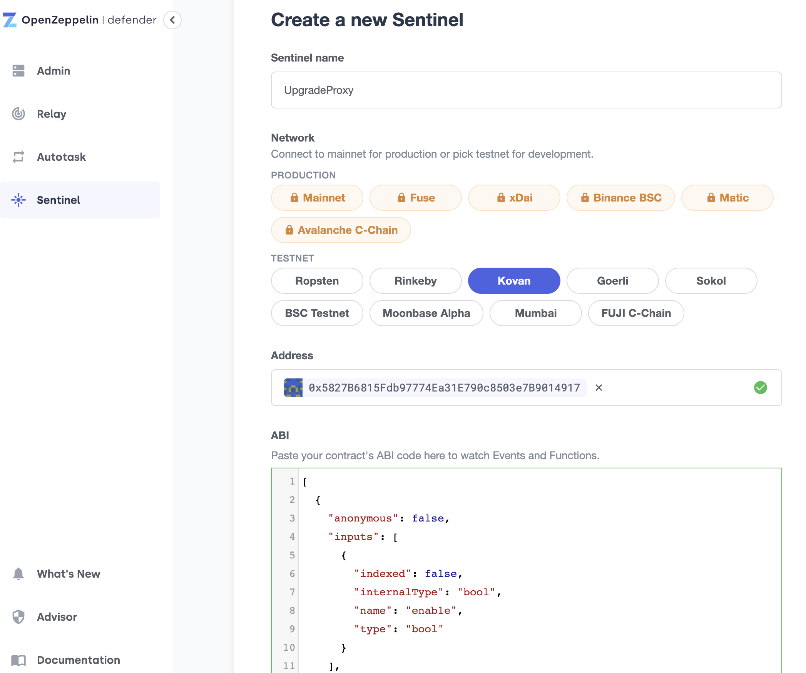
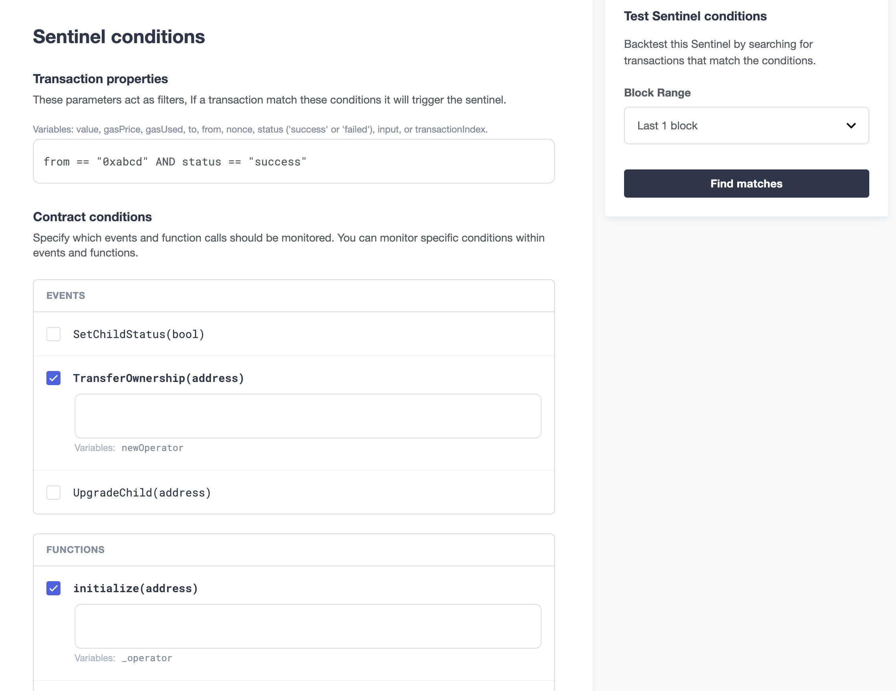
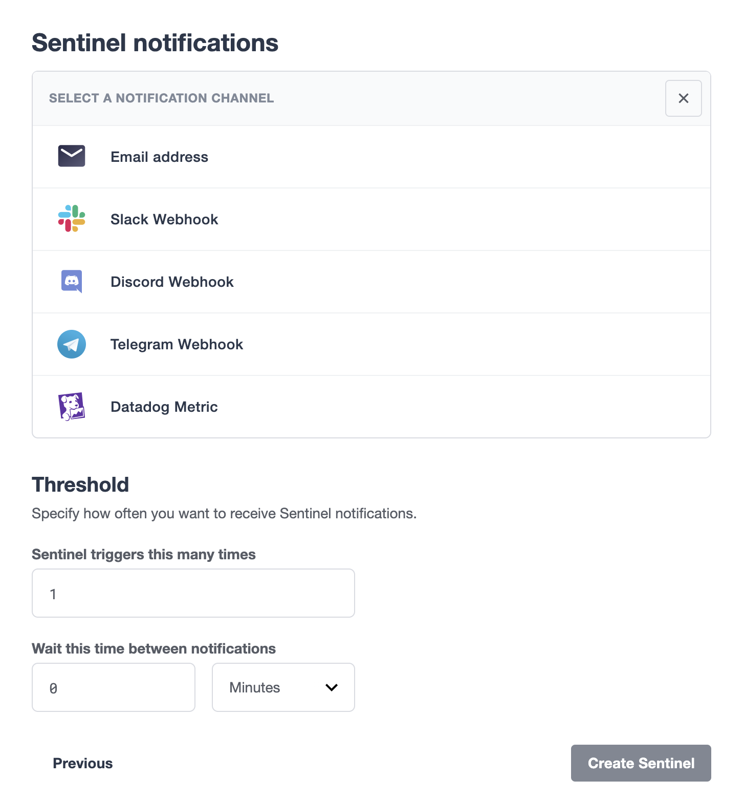

# Test Openzepplin Defender service

## Goals
### To test and record the findings of the following:
#### Detection
- Can it detect event emission? What's the success rate? How fast is it?
- Can it detect function call? What's the success rate? How fast is it?
- Can it detect message call (internal function call), i.e., function called by another contract? What's the success rate? How fast is it?
    - Can it detect failed message call or function call?

#### Response
- Cant it respond as instructed? What's the success rate? How fast is it?

## Contracts to test against

- `UpgradeProxy` and `UpgradeProxyImplementation`
    - This pair of contracts are used to test upgrade proxy functionality
        - can upgrade function call/event be detected?
        - can implementation specific function call/event be detected?
- `OneRoleAccessControl`
    - This contract is used to test contract maintenance or allowance setting function calls
- `OneRoleAccessControlWithTimeLock`
    - This contract is used to test function calls like contract maintenance along with actions with time lock

**NOTE**:
- EIP1967 upgrade proxy pattern is used
- `CallProxy` contract is used to invoke message call (internal function call).
## Scripts

### Deploy contracts

- Deploy `CallProxy` contract
    - `npx hardhat run scripts/deploy/CallProxy.ts --network kovan`
- Deploy `UpgradeProxy` and `UpgradeProxyImplementation` contracts
    - `npx hardhat run scripts/deploy/UpgradeProxy_set.ts --network kovan`
- Deploy `OneRoleAccessControl` contract
    - `npx hardhat run scripts/deploy/OneRoleAccessControl.ts --network kovan`
- Deploy `OneRoleAccessControlWithTimeLock` contract
    - `npx hardhat run scripts/deploy/OneRoleAccessControlWithTimeLock.ts --network kovan`

### Set up Sentinel instances
1. Go to https://defender.openzeppelin.com/#/sentinel and sign up
2. Hit `Create Sentinel` button to create new Sentinel instnace

3. Input instance name, choose network, input contract address and ABI and choose confirmation blocks
    - if the contract is verified, it would automatically fetch the ABI from etherscan
    - otherwise you have to paste the contract ABI
    - confirmation blocks determine how many blocks are confirmed before Sentinel sent the notification

4. Next, you can configure the filter and choose which events/functions to watch
    - for more information on configuring filters, go to [doc](https://docs.openzeppelin.com/defender/sentinel#matching-rules)
    - you can invoke functions and use the `Test Sentinel conditions` on the right to check if the invoked function calls are correctly captured

5. Last, create notifications and set notification thresholds
    - for example, using [Slack webhook](https://api.slack.com/messaging/webhooks)

### Run scripts to invoke targeted functions

- Transfer ownership, for example
    - `OneRoleAccessControl.transferOwner`
        - `npx hardhat run scripts/transferRoles/transferOwner_OneRoleAccessControl.ts --network kovan`
        - invoke failed function call
            - `npx hardhat run scripts/transferRoles/fail/fail_transferOwner_OneRoleAccessControl.ts  --network kovan`
    - `OneRoleAccessControlWithTimeLock.setNewOperator`
        - `npx hardhat run scripts/transferRoles/setNewOperator_OneRoleAccessControlWithTimeLock.ts --network kovan`
        - invoke failed internal function call
            - `npx hardhat run scripts/transferRoles/fail/fail_internal_setNewOperator_OneRoleAccessControlWithTimeLock.ts  --network kovan`
- Contract maintenance, for example
    - `OneRoleAccessControlWithTimeLock.blacklist`
        - `npx hardhat run scripts/maintenance/blacklist.ts --network kovan`
        - invoke failed function call
            - `npx hardhat run scripts/maintenance/fail/fail_blacklist.ts --network kovan`
- Approving spender, for example
    - `OneRoleAccessControlWithTimeLock.authorize`
        - `npx hardhat run scripts/allowance/authorize.ts --network kovan`
        - invoke failed internal function call
            - `npx hardhat run scripts/allowance/fail/fail_authorize.ts --network kovan`
- Upgrade proxy implementation, for example
    - `TransparentUpgradeableProxy.upgradeTo`
        - `npx hardhat run scripts/upgradeProxyImpl/upgradeTo_UpgradeProxyImplementation.ts --network kovan`
        - invoke failed internal function call
            - `npx hardhat run scripts/upgradeProxyImpl/fail/fail_internal_upgrade_UpgradeProxyImplementation.ts --network kovan`

## Deployed contract addresses

- `CallProxy`
    - `0x1E8b65D0562f89A1Bd951ADD5354d9a374dfe550`
- `UpgradeProxy`
    - `0x5827B6815Fdb97774Ea31E790c8503e7B9014917`
- `UpgradeProxyImplementation`
    - `0x77a6302d81154603Ac32d031275E9C9103B50D29`
- `OneRoleAccessControl`
    - `0x592360B99910Fa8Fc73b49dB32155BCeEB8E4F12`
- `OneRoleAccessControlWithTimeLock`
    - `0x9D1F313beb8342673E4f90a4c7Dd04C292984208`

NOTE: if you deploy new contract instances, remeber to update the contract address in `./scripts/utils.ts`