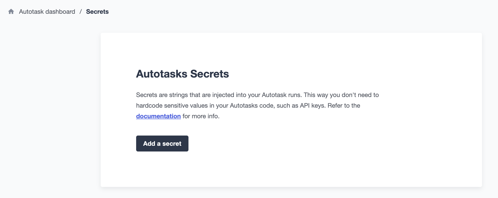
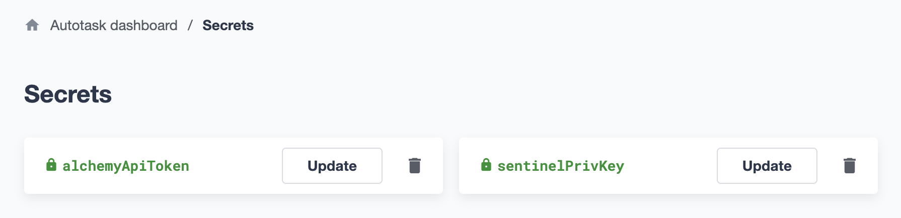
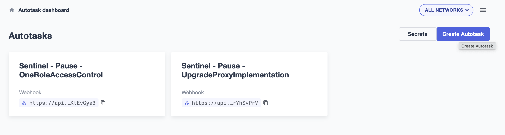
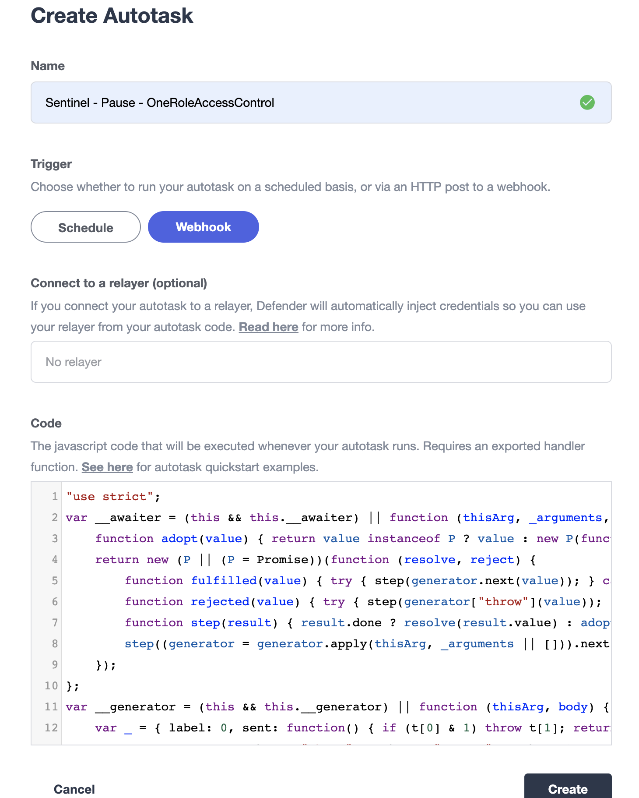
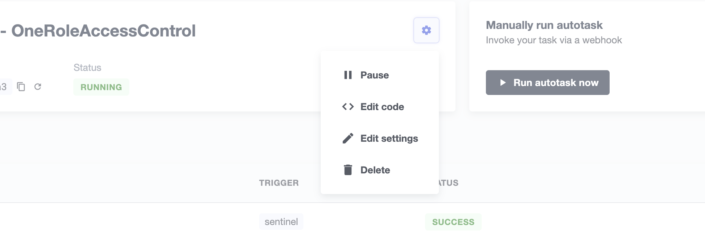
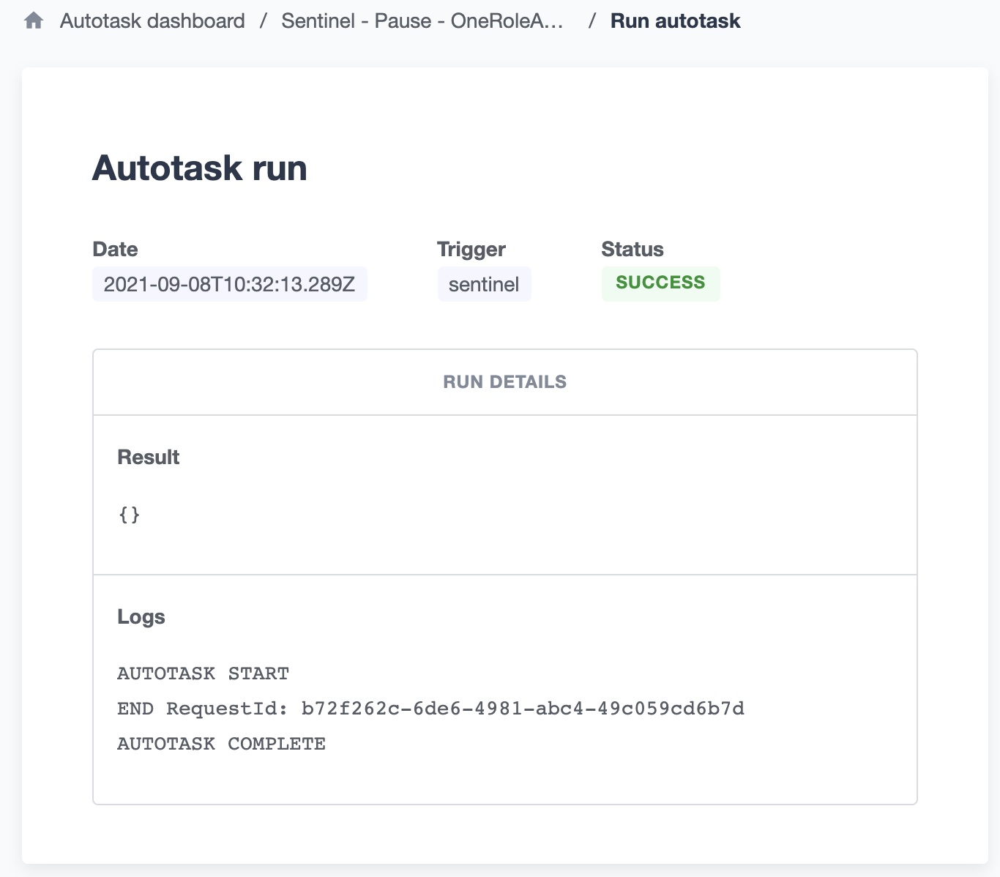

## Set up Autotask instances

1. Go to https://defender.openzeppelin.com/#/autotask and sign up
2. Hit the `Secrets` button and then the `New secret` button to add secrets like private key or RPC api key
    - Note that saving private key as secrets in Autotask is not 100% safe since you might accidentally print out these secrets during debugging of `Autotask` script
    - as Openzeppelin suggested, you should use the `Relayer` service to control your EOA

3. Back to `Autotask` dashboard and hit the `Create Autotask` button to create new Autotask instnace

4. Input instance name, choose `Webhook` as trigger
5. Paste the `Autotask` scripts to `Code` section and hit `Create` button
- `pause` contract [script](./scripts/autotask/pause/OneRoleAccessControl.js) for `OneRoleAccessControl` contract
- `pause` contract [script](./scripts/autotask/pause/UpgradeProxyImplementation.js) for `UpgradeProxyImplementation` contract
- Note that these javscritp scripts are compiled from its original one written in typescript
    - everytime after you update, for example, OneRoleAccessControl [script](./scripts/autotask/pause/OneRoleAccessControl.ts), you have to run `npx tsc scripts/autotask/pause/OneRoleAccessControl.ts` and copy-paste the compiled OneRoleAccessControl.js scripts to `Code` section in your Autotask instance

6. You are all set, go invoke functions and see if scripts are executed as expected.

- You can see the history of execution (`Runs history`) or edit the code/settings in instance's info page.

- You can click the run info to see the return values and logs.
    - return values will be in `Result` section
    - you can `console.log` in your script and they will show up in `Logs` section

