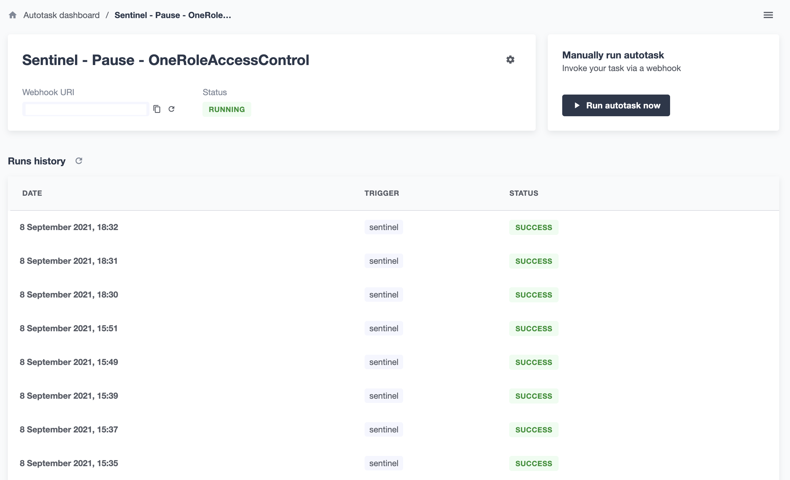

## Set up Autotask instances

1. Go to https://defender.openzeppelin.com/#/autotask and sign up
2. To set up an account that executes tasks/transactions instructed in our Autotask scripts, we have two choices: **use our own EOA** or **use a `Relayer` instance**
    - Here we will use relayer, go [set up a Relayer instance](./setupRelayer.md) 

3. Back to `Autotask` dashboard and hit the `Create Autotask` button to create new Autotask instnace

4. Input instance name, choose `Webhook` as trigger
5. In `Connect to a relayer` section, select the name of the relayer instance you created
6. Paste the `Autotask` scripts to `Code` section and hit `Create` button
- `pause` contract [script](./scripts/autotask/pause/OneRoleAccessControl.js) for `OneRoleAccessControl` contract
- `pause` contract [script](./scripts/autotask/pause/UpgradeProxyImplementation.js) for `UpgradeProxyImplementation` contract
- Note that these javscritp scripts are compiled from its original one written in typescript
    - everytime you modify any of these scripts, e.g., [OneRoleAccessControl.ts](./scripts/autotask/pause/OneRoleAccessControl.ts), you have to run `npx tsc scripts/autotask/pause/OneRoleAccessControl.ts` and copy-paste the compiled OneRoleAccessControl.js scripts to `Code` section in your Autotask instance

7. You are all set, go invoke functions and see if scripts are executed as expected.

___

- In instance's info page, you can see the history of execution (`Runs history`) or edit the code/settings.

- You can click the run info to see the return values and logs.
    - return values will be in `Result` section
    - you can `console.log` in your script and they will show up in `Logs` section

___

More about `Autotask` service: https://docs.openzeppelin.com/defender/autotasks