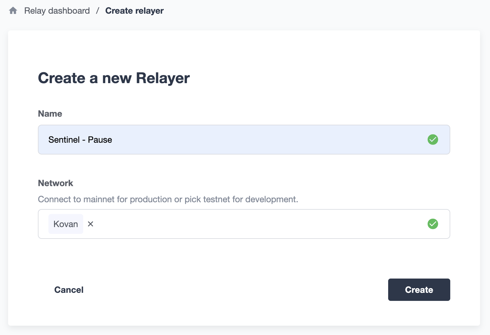
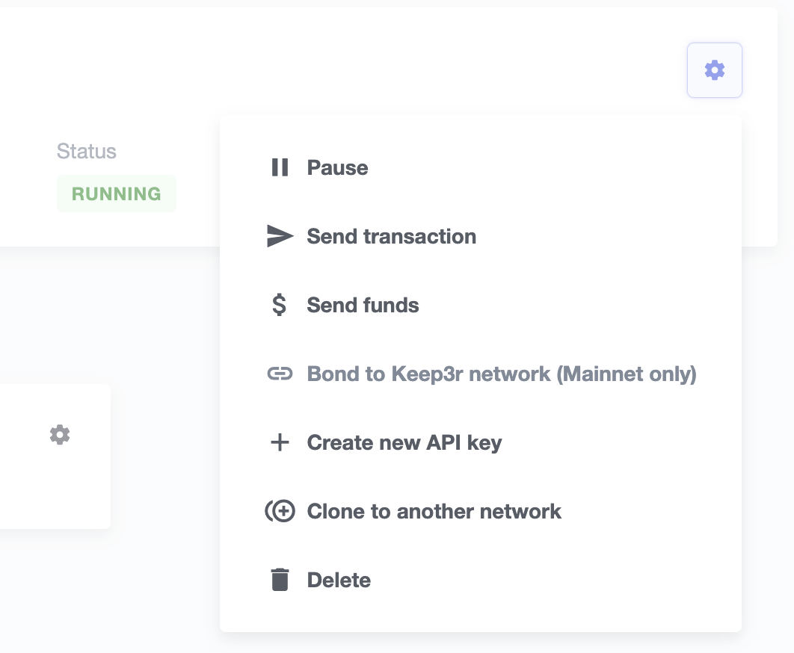

## Set up Relayer instances

1. Go to https://defender.openzeppelin.com/#/relay and sign up
2. Hit the `Create Relayer` button to create new Relayer instnace
3. Input instance name, choose network and hit `Create`

4. It will generate an EOA and show you it's `address`, `API Key` and API's `Secret Key`
    - You need to write down API's `Secret Key` if you want to send request to your relayer outside of Defender services
    - But you don't have to if you are using it from within, e.g., from an `Autotask` instance, it will automatically handle the authentications for you
    - And it is easy to create a new API key so don't worry too much if you forgot the secret key
5. Finally you need to fund this relayer by sending ETH to it
    - For relayers in Goerli and Rinkeby networks, you don't have to fund them yourself, Defender will top up the balance for you
    - Defender will send you email notification once the relayer is running low on funds (below 0.1 ETH)
6. Now you can use the relayer from other services like `Autotask`

___

- You can create new API keys or sending arbitrary transactions like sending ETH/tokens from your relayer

___

More about `Relayer` service: https://docs.openzeppelin.com/defender/relay
