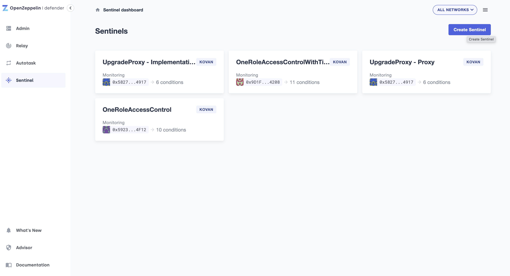
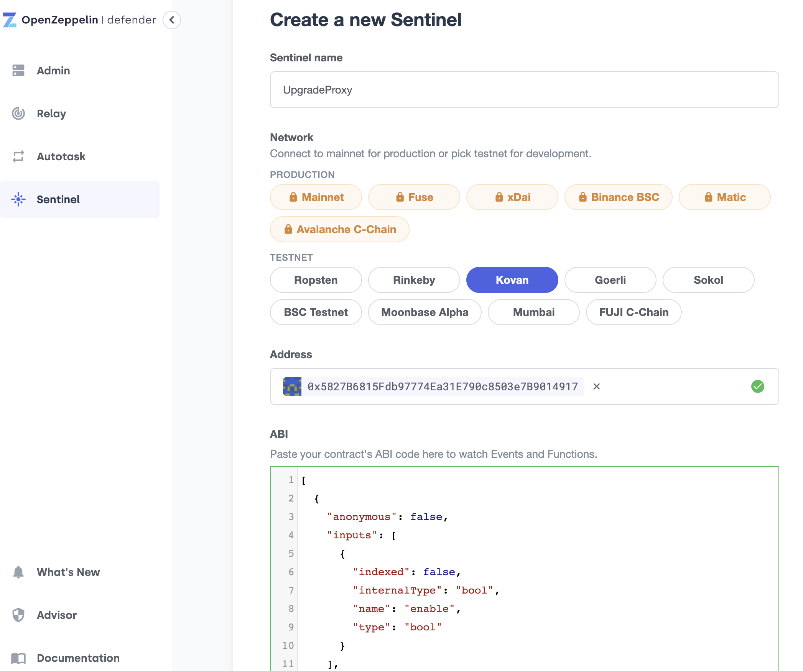
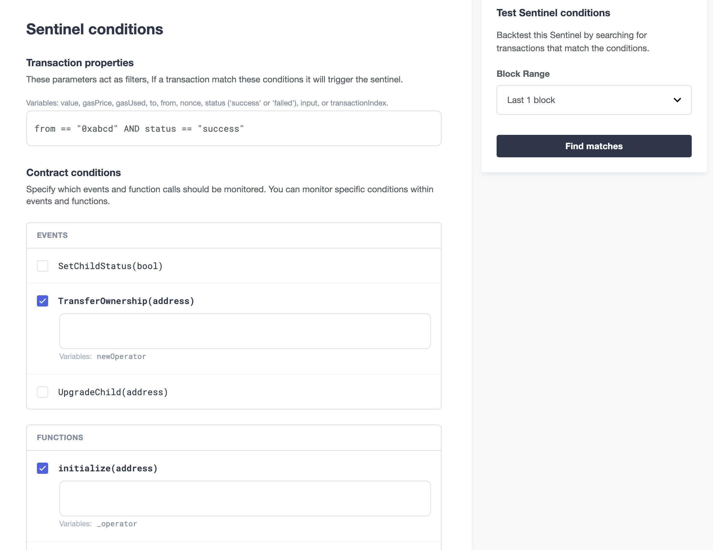
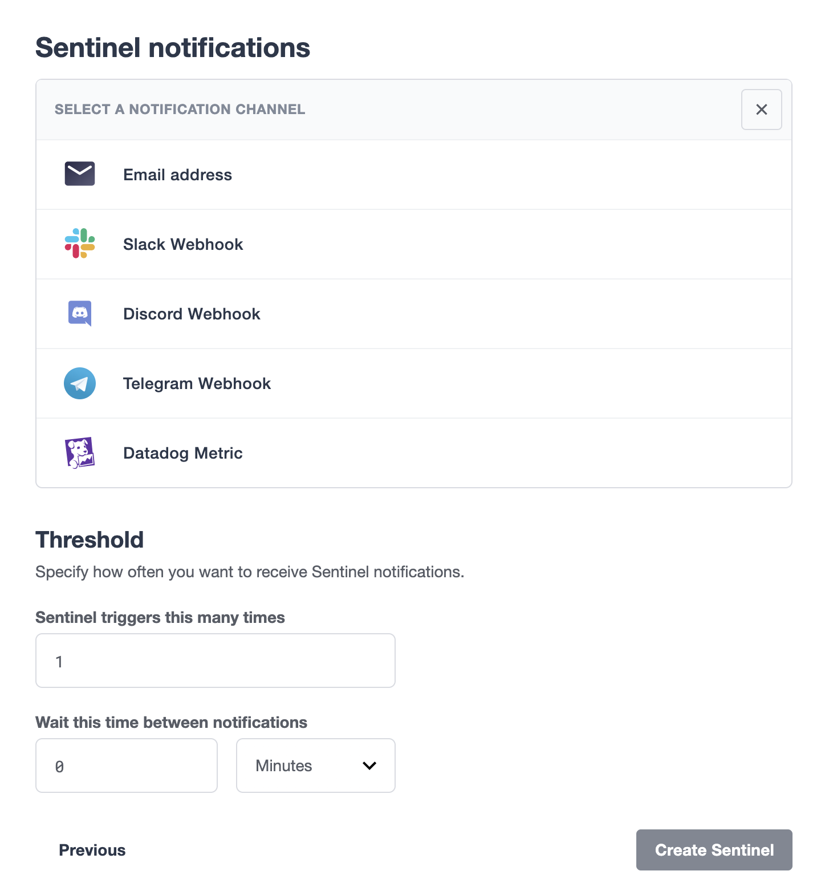

## Set up Sentinel instances

1. Go to https://defender.openzeppelin.com/#/sentinel and sign up
2. Hit the `Create Sentinel` button to create new Sentinel instnace

3. Input instance name, choose network, input contract address and ABI and choose confirmation blocks
    - if the contract is verified, it would automatically fetch the ABI from etherscan
    - otherwise you have to paste the contract ABI
    - confirmation blocks determine how many blocks are confirmed before Sentinel sent the notification

4. Next, you can configure the filter and choose which events/functions to watch
    - for more information on configuring filters, go to [doc](https://docs.openzeppelin.com/defender/sentinel#matching-rules)
    - you can invoke functions and use the `Test Sentinel conditions` on the right to check if the invoked function calls are correctly captured

5. Last, create notifications and set notification thresholds
    - for example, using [Slack webhook](https://api.slack.com/messaging/webhooks)
    - you can use the default threshold values which will send notification on every matched event/function call

